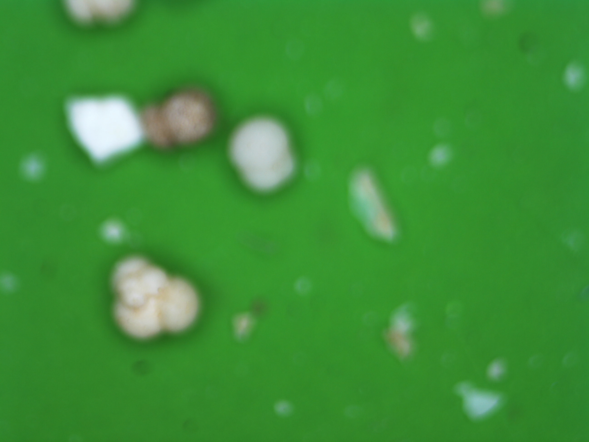

Домашнее задание к лекции #1 по теме "Классификация задач и методов машинного обучения". вес = 0.4, максимальный балл = 100.

Ниже описаны сферы деятельности в науках о Земле и некоторые проблемы, представляющие интерес для исследователей. Задание заключается в том, чтобы сформулировать задачи (две или более) в терминах машинного обучения, которые можно было бы решать, имея в распоряжении описанные данные. Решение таких задач не обязательно разрешают описанные проблемы, но могут приближать к их разрешению. Проявите фантазию в отношении формулировки задач. Но при этом для каждой задачи следует указать следующие составляющие:

1. тип задачи МО ("С учителем" / "Без учителя" / другое (уточнить) )
2. вид задачи МО (регрессия, кластеризация, понижение размерности, классификация, ...)
3. целевая переменная, указать ее тип (категориальная, действительная, бинарная...) и размерность (количество значений на один объект/событие). Напомним, что целевая переменная должна описываться численно. Мы имеем дело с машинным обучением: здесь нет места абстракциям и нечетким формулировкам ("положение точки", "характер взаимодействия", "далеко", "близко", "сильно взаимодействующие" и проч.) Все величины должны быть сформулированы численно.
4. описать общий смысл функции потерь, если это подразумевается типом задачи. Если есть возможность - выписать явный вид функции потерь Мы еще не разбирали подробно понятие функции потерь, их виды и назначение. Но уже упоминалось, что оптимизация ("настройка", "обучение", "тренировка")  моделей МО производится посредством минимизации некоторого функционала, который отражает, насколько сильно модель ошибается. В оптимальном (настроенном, натренированном, обученном) состоянии модель ошибается меньше всего. В этом пункте следует описать общий смысл ошибки модели, которую можно ИЗМЕРИТЬ (посчитать, оценить), имея на руках результаты модели. ВНИМАНИЕ! Неточный ответ на этот вопрос, неверный ответ, отсутствие формулы - не влекут снижение оценки. Отсутствие ответа влечет снижение оценки.
5. описать объекты (события) в формулируемой задаче
6. предложить признаковое описание объектов/событий или описать уже имеющееся признаковое описание. Указывать тип признаков (действительные, категориальные, бинарные величины) и размерность признакового описания (количество признаков, характеризующих каждый объект/событие). Так же как и в случае целевой переменной, следует помнить, что признаковое описание в МО - только численное.
7. (опционально, +10 баллов) предложить возможные варианты дополнения признакового описания  или понижения его размерности, потенциально позволяющие упростить решение. Это творческое задание. Отсутствие ответа, неверный ответ, неточный ответ на этот вопрос не влекут снижения оценки.
8. исходя из понимания задачи, предложить метрику (метрики) для оценки качества модели МО. Мы еще не разбирали подробно понятие метрики качества, однако этот термин уже упоминался при формулировке подхода машинного обучения. Метрика качества - число, характеризующее качество модели. По смыслу она похожа на функцию потерь, но в отличие от функции потерь обычно (не всегда!) метрика качества применяется в подходе "чем больше, тем лучше". ВНИМАНИЕ! Метрика качества - не то же самое, что функция потерь с минусом. Очень часто бывает так, что метрика качества - величина, которую очень сложно оптимизировать. Поэтому вводят функцию потерь, которую оптимизировать легко, и при этом есть надежда на то, что автоматически будет улучшаться качество по введенной метрике. Как и в случае функции потерь, неточный ответ, неверный ответ, отсутствие формулы - не влекут снижение оценки. Отсутствие ответа влечет снижение оценки.

Область исследований №1. Облачность и коротковолновая солнечная радиация.

Приходящая солнечная радиация - единственный (условно) стабильный и (условно) восполняемый источник энергии на планете Земля. Кроме того, солнечная радиация - практически единственный источник энергии, питающий всю динамику атмосферы и океана. Радиационный блок в моделях атмосферы - важнейшая часть. Для оценки приходящей солнечной радиации в моделировании геофизических систем в настоящий момент чаще всего применяются т.н.. параметризации - упрощенные схемы, аппроксимирующие процессы рассеяния, поглощения, переотражения, переизлучения солнечной радиации в атмосфере. Важнейшей переменной во всех параметризациях приходящей солнечной радиации является общий балл облачности, количество облачности различных типов, насыщенность облаков (водность) и прочие характеристики облачности.

Для построения аккуратной параметризации потоков приходящей на поверхность коротковолновой и длинноволновой радиации нужны долговременные ряды соответствующих показаний радиометрических приборов и оценки балла общей облачности.

В Лаборатории взаимодействия океана и атмосферы и мониторинга климатических изменений ведется работа по автоматизации наблюдений за облачностью. Для этого была разработана и апробирована установка, проводящая оптическую съемку облачности с поверхности. Результатом съемки являются снимки следующего рода:

<table>
    <tr>
        <td width="50%">
            
        </td>
        <td width="50%">
            
        </td>
    </tr>
</table>

Рис. 1. Снимки видимой полусферы небосвода над океаном, сделанные двумя разнесенными на расстояние L камерами.

Одновременно со съемкой ведутся визуальные наблюдения. В результате таких наблюдений фиксируются:

- балл общей облачности, оцененный наблюдателем

- баллы облачности по трем ярусам (нижний, средний, верхний), оцененные наблюдателем

- наблюдаемые типы облачности

- наблюдаемое состояние диска солнца (4 класса от "пасмурно" до "Солнце в квадрате")

Одновременно со съемкой также непрерывно в автоматическом режиме производится запись показаний радиометрического оборудования: потоки приходящей коротковолновой и длинноволновой радиации.

Интерес для исследователей представляют зависимости потока приходящей коротковолновой и длинноволновой солнечной радиации от количества облаков, от соотношения типов наблюдаемых облаков, от высоты нижней границы облачности. Также интерес представлют сами оценки высоты нижней границы облачности, поскольку эта характеристика явлется важным косвенным показателем динамики атмосферы. Кроме того интерес представляют само количество облачности, поскольку некоторые задачи, в которых этот показатель может использоваться, еще даже не сформулированы, а оценку вести нужно уже сейчас (чтобы получать долговременные ряды, позволяющие оценивать тенденции на климатическом масштабе времени).

---

Область исследований №2. Состав осадочных пород.

Палеореконструкция - способ оценки геофизических параметров по косвенным признакам, таким как химический состав раковин фораминифер, концентрация различных газов в осадочных породах на дне океана и пр. Распределение видов и размеров фораминифер, размеров и форм кристаллов различных минералов в осадочных породах - важнейшие характеристики, по которым можно восстановить направление и скорость течений, температуру и соленость воды и другие важнейшие геофизические характеристики. Пробы (керны) осадочных пород берутся в каждой геологической экспедиции ИОРАН. Каждый срез керна (соответствующий определенному времени в прошлом) предоставляет уникальную информацию об условиях формирования осадка в момент его накопления. Высушенные и разобранные по зернам образцы выглядят как песок, однако содержат ценную информацию в виде распределения видов и размеров зерен.

В Лаборатории палеоокеанологии ведется работа по микрофотографии некоторых из этих образцов для автоматизации оценки распределений по размерам, видам фораминифер и типам зерен. Каждый участок образца фотографируется шесть раз с различным фокусным расстоянием. В результате в распоряжении исследователя имеются серии снимков следующего рода:

<table>
    <tr>
        <td width="16%">
            
        </td>
        <td width="16%">
            
        </td>
        <td width="16%">
            
        </td>
    </tr>
    <tr>
        <td width="16%">
            
        </td>
        <td width="16%">
            
        </td>
        <td width="16%">
            
        </td>
    </tr>
</table>

<table>
    <tr>
        <td width="16%">
            
        </td>
        <td width="16%">
            
        </td>
        <td width="16%">
            
        </td>
    </tr>
    <tr>
        <td width="16%">
            
        </td>
        <td width="16%">
            
        </td>
        <td width="16%">
            
        </td>
    </tr>
</table>

Рис. 2. Серии (по 6 шт. с различным фокусным расстоянием) снимков препарата осадочных пород.

Интерес исследователей состоит в том, чтобы оценивать долю каждого из видов фораминифер (вернее, раковинок, которые от них остались) по количеству в образце, для чего нужно определить вид каждой раковины. Кроме этого, интересно также оценивать долю минеральных зерен различного вида. Для того, чтобы проводить такие оценки, необходимо автоматизировать много промежуточных этапов: обнаружение отдельных зерен на снимке, их разделение по типам и проч.

---

Область исследований №3. Мезомасштабные атмосферные явления.

Интенсивные атмосферные явления (здесь будут рассматриваться тропические циклоны и мезомасштабные циклоны) часто ассоциированы с сильным приповерхностным ветром, что влечет угрозу судоходству, морским и береговым инфраструктурным объектам, жилищам. Тропические циклоны известны массовому читателю благодаря разрушительному воздействию некоторых из них на юго-восточных территориях США. Мезомасштабные циклоны не настолько известны, однако за счет сильного ветра на поверхности океана и, как следствие, интенсивных потоков скрытого тепла, они могут инициировать глубокую конвекцию в океане.

Изучение экстремальных атмосферных явлений опирается на составленные климатологии - базы данных идентифицированных событий и их траекторий. Мезоциклоны удобнее всего идентифицировать в спутниковых снимках, поскольку они четко различимы в поле облачности. Облачность, в свою очередь, ярко выделяется на инфракрасных спутниковых снимках, особенно над относительно теплой поверхностью океана. Спутниковые снимки в инфракрасном диапазоне выглядят следующим образом:

<table>
    <tr>
        <td width="50%">
            
        </td>
        <td width="50%">
            
        </td>
    </tr>
</table>

Рис. 3. Инфракрасные спутниковые мозаики антарктического региона.

На рис. 3. справа отмечены положения и размеры идентифицированных экспертом мезоциклонов. Однако следует учитывать, что такая разметка занимает много времени. Для построения глобальной климатологии мезоциклонов использовать труд эксперта экономически нецелесообразно. Интерес для исследователей представляет процесс идентификации интенсивных атмосферных явлений: определение их наличия, размеров, положения, скорости перемещения, направления перемещения и проч.