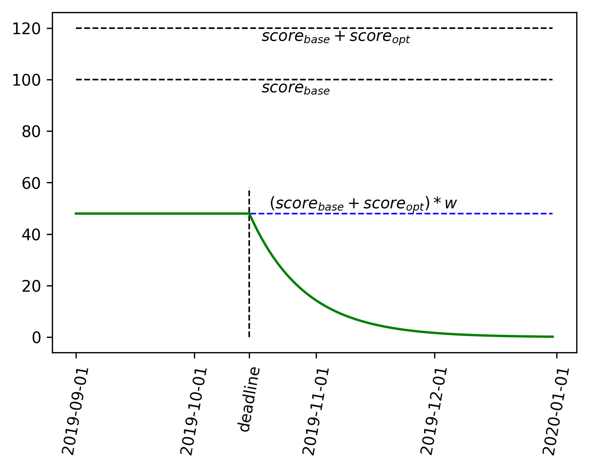

# ML4ES_2019-2020
### Метод оценки прогресса студентов

Домашние задания публикуются со следующими атрибутами:

- Максимальное (номинальное) количество баллов (обычно 100) - базовая шкала оценки. Максимальная номинальная оценка, которую можно получить за основную часть домашнего задания.

Опциональные задания оцениваются дополнительно. Баллы суммируются с оценкой за основную часть ДЗ.

- Вес задания (например, 0.4). Коэффициент сложности/трудности, с которым оценивается вклад ДЗ в общий балл за семестр.

Дальнейшее оценивание прогресса студента по каждому ДЗ производится по формуле:

    

Пояснение - на рис. 1.

Рис. 1. Оценка домашнего задания (зеленая линия) в зависимости от даты сдачи.

В конце семестра все баллы суммируются.

Запланированные домашние задания:

| ДЗ                                                           | номинальное кол-во баллов | доп. баллы | вес  | макс. возможный взвешенный балл |
| ------------------------------------------------------------ | ---------------------------- | ------------- | ---- | ---------------------------------- |
| [HW01](https://github.com/MKrinitskiy/ML4ES_2019-2020/tree/master/HW01) | 100                          | -             | 0.4  | 40                                 |
| [HW02](https://github.com/MKrinitskiy/ML4ES_2019-2020/tree/master/HW02) | 100                          | -             | 0.2  | 20                                 |
| [HW03](https://github.com/MKrinitskiy/ML4ES_2019-2020/tree/master/HW03) | 100                          | -             | 2.0  | 200                                |

Максимальный балл, который возможно набрать в первом семестре - 650 (795 с доп. заданиями).

Проходной балл на автозачет - 75% максимального. При полном выполнении плана - 487 баллов.

Проходной балл на допуск к зачету - 25% максимального. При полном выполнении плана - 162 балла.

По состоянию на 29.10.2019 максимальный балл - 60, проходной балл на автозачет - 45, проходной балл на допуск к зачету - 15.

**UPDATE 2019-11-27:**
`Максимальный балл в первом семестре - 260
Проходной балл на автозачет в первом семестре - 195
Проходной балл на допуск к зачету в первом семестре - 65`